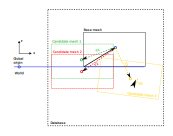
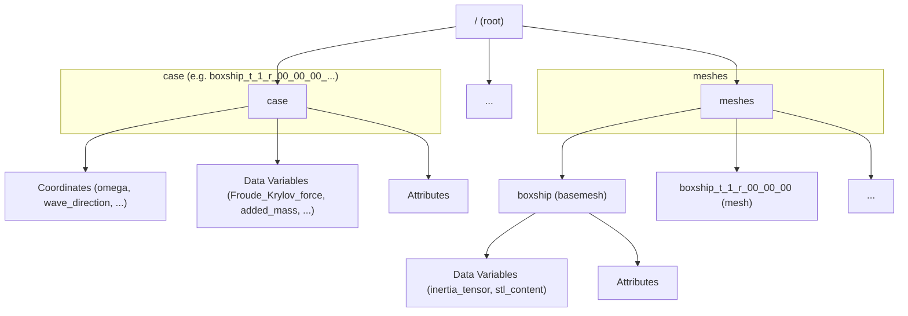

# Solution Database

## Introduction

Fleetmaster is used to generate an HDF5 database containing a collection of Capytaine solutions based on a single base mesh. The solutions can vary depending on parameters such as the draft of the mesh, rotation of the mesh, forward speed of the vessel (an input parameter for Capytaine), or the water depth. Each individual mesh transformation (based on draft and rotation) is stored in the `/meshes` group. All solutions are stored in separate groups within the HDF5 database. A single solution always references the name of the input mesh used and includes all other parameters that were varied for that specific case.

## Mesh definitions

Each HDF5 database is built around a single **base mesh**. This base mesh serves as the fundamental reference geometry. 

**The origin of the base-mesh should correspond to a known point POINT ON THE VESSEL.**

**The scale of the mesh should be meters**

**The origin of the mesh, as well as the axis definition, shall be documented as text.** 

**Recommendation:**

- **Origin: stern, centerline, keel**
- **X towards bow**
- **Y towards PS**
- **Z upwards**

 point when you position the mesh in a global context. The name of this base mesh is stored as a root-level attribute named `base_mesh` in the HDF5 file. The geometry of the base mesh itself is stored as a dataset within the `/meshes` group.

In addition to the base mesh, the `/meshes` group can contain multiple **candidate meshes**. Each candidate mesh represents a variation of the base mesh and has the following characteristics:

- A unique mesh name.
- Its own geometry, stored as a dataset.
- A `translation` and `rotation` attribute, which define its position and orientation relative to the base mesh
- A specific `cog` (center of gravity) attribute. This `cog` is used by Capytaine as the center for the BEM (Boundary Element Method) solution.
- **The point of application. This is the point on which the calculated forces act and relative to which the phases are calculated.** **Typical locations are the center of flotation or the center of buoyancy.**

The transformation from the base mesh to a candidate mesh is applied in a specific order: first, rotation is performed around the `cog`, and then translation is applied. These transformation attributes are stored for each mesh.

{id="database"}

In [Figure 1](#database), the relation between the base mesh and the different candidate meshes is shown.
The black box represents the base mesh, assumed to be with its keel on the water surface ($z=0$) and its stern at $x=0$ and $y=0$.
The base mesh can be any STL file representing the floating body for which you want to calculate the force response values.
The position of the base mesh is arbitrary and can be anywhere. The relation of the base mesh to the real world is established via the `base_origin`, represented by the black vector pointing from the bottom-left corner of the base mesh to the black circle in the middle.
Both the base name and origin are stored at the root level of the database.
You can relate the base mesh to the real world by connecting the `base_origin` to your real-world coordinate system.

Normally, the base mesh is not used directly to calculate hydrodynamic data with Capytaine. This is done using the candidate mesh positions.
In [Figure 1](#database), these are represented by the green, red, and yellow boxes, labeled candidate mesh 1, 2, and 3, respectively.
The relationship between the base mesh and a candidate mesh is defined by a translation vector, a rotation vector, and a center of gravity (CoG) vector for the mesh.
The CoG vector does not have to correspond to the geometric center of gravity of your mesh (although this is chosen by default if no vector is provided).
It can often be set to (0,0,0), which is typically at the center of the waterline. The CoG position is also used as the center of rotation.

In our example, both the red and green meshes are shifted backward so that the CoG of the mesh is at (0, 0, 0). The mesh itself is shifted downward to establish the vessel's draft. The rotation for the green and red boxes is assumed to be (0, 0, 0).

The yellow box shows an example of a candidate mesh that is shifted downward and given a small positive rotation about the y-axis. This is stored in the rotation vector belonging to the yellow mesh.

All candidate meshes are stored with a unique name in the HDF5 database under the `/meshes` group.

Then, we can define Capytaine cases for each of these candidate meshes. One mesh can be associated with multiple cases, but a single case can only be linked to one mesh. This allows us to define multiple cases for a similar geometry, enabling variations such as forward speed or water depth to be studied.
For each case, the solution is stored in a separate case group.

The Capytaine solutions for each case are calculated for a mesh over a range of wave directions (headings) and periods (frequencies).
Each case can have its own definition of directions and periods.

## HDF5 file structure

The structure of the database is shown in the diagram below. The root contains the `base_mesh` and `base_origin` attributes.
There are two major groups: a `meshes` group (containing all meshes) and a `cases` group (containing all cases).

The HDF5 file has two main groups at the root level:

- **cases**: A variable number of groups, each representing a single Capytaine solution for a specific condition (transformation, forward speed, etc.). The group name is a composite of the parameters.
- **meshes**: This group contains all the mesh geometries.

### Root Attributes

The root of the HDF5 file has the following attributes:

- `base_mesh`: The name of the base mesh (e.g., `boxship`).
- `base_origin`: The origin of the base mesh.

### Case Group

Each case group (e.g., `/boxship_t_1_r_00_00_00_wd_inf_wl_0_fs_0`) contains the full output of a Capytaine simulation.

| Category           | Name                  | Description                                           |
| :----------------- | :-------------------- | :---------------------------------------------------- |
| **Coordinates**    | `omega`               | Array of wave frequencies.                            |
|                    | `wave_direction`      | Array of wave directions.                             |
|                    | `influenced_dof`      | Degrees of freedom being influenced.                  |
|                    | `radiating_dof`       | Degrees of freedom that are radiating.                |
| **Data Variables** | `Froude_Krylov_force` | Froude-Krylov force components.                       |
|                    | `added_mass`          | Added mass matrix.                                    |
|                    | `radiation_damping`   | Radiation damping matrix.                             |
|                    | `diffraction_force`   | Diffraction force components.                         |
|                    | `excitation_force`    | Total excitation force (Froude-Krylov + Diffraction). |
|                    | `body_name`           | Name of the body.                                     |
|                    | `forward_speed`       | Forward speed of the vessel.                          |
|                    | `...`                 | Other variables from Capytaine.                       |
| **Attributes**     | `mesh_name`           | Name of the mesh used for this case.                  |
|                    | `draft`               | Draft of the mesh.                                    |
|                    | `transformation`      | Transformation matrix applied to the mesh.            |
|                    | `rotation`            | Rotation applied to the mesh.                         |
|                    | `...`                 | Other case-specific attributes.                       |

### Meshes Group

The `/meshes` group contains a subgroup for each mesh.

| Category           | Name                            | Description                                              |
| :----------------- | :------------------------------ | :------------------------------------------------------- |
| **Data Variables** | `inertia_tensor`                | The 3x3 inertia tensor of the mesh.                      |
|                    | `stl_content`                   | The binary content of the STL file for the mesh.         |
| **Attributes**     | `name`                          | Name of the mesh.                                        |
|                    | `bbox_lx`, `bbox_ly`, `bbox_lz` | Dimensions of the bounding box.                          |
|                    | `cog`                           | Center of gravity used by Capytaine `[x, y, z]`.         |
|                    | `cog_x`, `cog_y`, `cog_z`       | Individual components of the center of gravity.          |
|                    | `rotation`                      | Rotation applied to the mesh `[rx, ry, rz]`.             |
|                    | `translation`                   | Translation applied to the mesh `[tx, ty, tz]`.          |
|                    | `volume`                        | Displaced volume of the mesh.                            |
|                    | `sha256`                        | SHA256 hash of the mesh geometry for integrity checking. |
