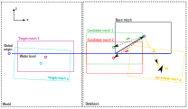

# Mesh Fitting

As explained in the previous section, Capytaine solutions for multiple meshes and boundary conditions can be stored efficiently in the HDF5 database. This allows external tools to extract solutions as needed. Although, in principle, a new case file can be added to the HDF5 database for each draft or process condition, in practice, it is often sufficient to use an existing solution from the database that is close enough to the actual situation.

Fleetmaster provides a mesh fitting capability that allows you to find the best-matching mesh from a database of pre-calculated meshes based on a target transformation (translation and rotation). This is particularly useful in scenarios where you have a database of hydrodynamic results for a vessel at various drafts and trim/heel angles, and you want to find the results that best correspond to a new loading condition.

## How it Works

The core of the fitting functionality is the `find_best_matching_mesh` function. This function takes a target transformation and an HDF5 database file as input and returns the name of the best-matching mesh from the database.

The process involves the following steps:

1.  **Load Data**: The function loads a `base_mesh` and a set of `candidate_meshes` from the specified HDF5 file. The `base_mesh` is the original, untransformed mesh of the vessel, while the `candidate_meshes` represent the vessel at different, pre-defined transformations (e.g., different drafts, roll, and pitch angles).

2.  **Hybrid Transformation**: For each `candidate_mesh`, a hybrid transformation is applied to the `base_mesh`. This transformation is designed to isolate the parameters that are most relevant for hydrodynamic behavior:

    - **Z-translation (draft)** and **X/Y-rotations (roll, pitch)** are taken from the _target_ transformation.
    - **X/Y-translation** and **Z-rotation (yaw)** are taken from the _candidate's_ transformation.

    This approach allows for a fair comparison of the submerged shape of the vessel, which is what primarily influences the hydrodynamic response.

3.  **Chamfer Distance**: The wetted surface of the transformed `base_mesh` is then compared to the wetted surface of the `candidate_mesh` using the **Chamfer distance**. This metric calculates the average distance between the vertices of the two meshes, providing a robust measure of their similarity. A lower Chamfer distance indicates a better fit.

4.  **Best Match**: The function returns the name of the `candidate_mesh` with the lowest Chamfer distance, which is considered the "best fit".

## Illustration of a Use Case

{id="fitting"}

[Figure 2](#fitting) illustrates how mesh fitting works. On the left **RIGHT**, we see the same database of candidate meshes as described in the previous section. On the right **LEFT**, we have two example target meshes: Target Mesh 1 (purple) and Target Mesh 2 (cyan).

**Only the submeged parts of the meshes are present, except for the base-mesh**

Target Mesh 1 has no rotation and a draft very close to that of Candidate Mesh 2. We would therefore want to use the solution belonging to Candidate Mesh 2. To find this best match, the target mesh is translated and rotated according to each of our candidate meshes, but only for the XY-plane translation and the Z-axis rotation (yaw). The reason for this is that the Capytaine solution is independent of the mesh's location in the XY-plane; only the draft (Z-translation) and roll/pitch (X/Y-rotations) are relevant.

Therefore, we first align our target mesh with each candidate in the XY-plane. Then, we calculate the mean distance between the submerged parts of both the target and the candidate. We use the **Chamfer distance** for this, which is the root mean square distance between all mesh points. 


**This is very inconvenient as the mesh resolution may be different**


This Chamfer distance is calculated for all our candidate meshes. The mesh with the smallest Chamfer distance is the best fit for our case. For Target Mesh 1, this would be Candidate Mesh 2, as it yields the smallest Chamfer distance.

The second target mesh has a deeper draft and a slight pitch around the x-axis. In this case, the third candidate mesh would yield the smallest Chamfer distance after the meshes have been translated to the same position in the XY-plane.

## Usage Example

Here is an example of how to use the `find_best_matching_mesh` function:

```python
from pathlib import Path
from fleetmaster.core.fitting import find_best_matching_mesh

# Path to the HDF5 database
hdf5_path = Path("path/to/your/database.hdf5")

# Target transformation
target_translation = [0.0, 0.0, -1.5]  # Target draft of 1.5m
target_rotation = [5.0, 0.0, 0.0]      # Target roll of 5 degrees

# Find the best matching mesh
best_match, distance = find_best_matching_mesh(
    hdf5_path=hdf5_path,
    target_translation=target_translation,
    target_rotation=target_rotation,
    water_level=0.0,
)

if best_match:
    print(f"Best match found: {best_match}")
    print(f"Chamfer distance: {distance:.4f}")
```

This functionality enables you to efficiently leverage pre-computed hydrodynamic databases, finding the most relevant data for any given loading condition without needing to run new simulations for every case.
